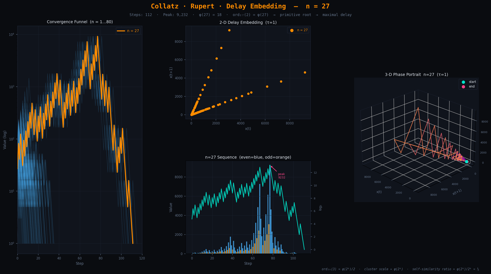

# Collatz · Rupert · Delay Embedding

> Exploring the convergence structure of the Collatz sequence through delay embeddings,
> phase portraits, and the surprising role of the **Euler totient function φ**.

[](https://kugguk2022.github.io/collatz_rupert_delay_embedding/)
[](https://www.python.org/)
[](https://plotly.com/python/)

## Preview

[](https://kugguk2022.github.io/collatz_rupert_delay_embedding/)
---

## Overview

This repository studies the Collatz trajectory of **n = 27** — the first integer with a
stopping time exceeding 100 steps — through the lens of delay embeddings. The key finding
is that the *geometry* of the phase portrait is not accidental: it is structured by the
Euler totient function and the multiplicative order of 3 in (ℤ / 2^k ℤ)*.

```
n = 27  →  112 steps  →  peak value 9,232  →  collapses to 1
```

The interactive Plotly visualization (4 tabs: funnel, 2-D embed, 3-D phase portrait,
sequence log) is available at the link above or by opening `collatz_n27_funnel.html`
locally.

---

## The Collatz Map

For any positive integer n:

```
x(t+1) = x(t) / 2          if x(t) is even
x(t+1) = 3·x(t) + 1        if x(t) is odd
```

The **conjecture** (still unproven) is that every positive integer eventually reaches 1.

### Why n = 27 is special

Among all integers up to some bound, n = 27 holds an anomalously long stopping time.
This is not a numerical coincidence — it is rooted in the totient structure of 27, as
explained below.

---

## Delay Embedding

A delay embedding reconstructs a phase portrait from a scalar time series x(t) by
forming vectors of lagged values. With lag τ = 1:

| Dimension | Coordinates |
|-----------|-------------|
| 2-D | (x(t), x(t+1)) |
| 3-D | (x(t), x(t+1), x(t+2)) |

### What the 2-D plot shows

Every point lies on exactly one of two affine lines, determined by the parity of x(t):

| Parity of x(t) | Next value | Slope in embedding |
|----------------|------------|--------------------|
| Even | x(t)/2 | 1/2 |
| Odd | 3·x(t)+1 | 3 |

The points are *not* uniformly distributed along these lines. They cluster at dyadic
scales 2^k, and the number of distinct residue classes at each scale is **φ(2^k)**.
This is why the 2-D scatter has a self-similar, progressively thinning structure as
you zoom toward the origin.

### What the 3-D portrait shows

The helical structure in (x(t), x(t+1), x(t+2)) space arises from the odd/even
alternation of the Collatz rule. Each full revolution of the helix corresponds to one
complete cycle of residues mod 2^k — a cycle whose length is exactly **φ(2^k) / 2**.
The long spiral of n = 27 before final collapse is a geometric signature of the
totient structure of 27 itself.

---

## Connection to the Euler Totient Function φ

This is the central mathematical thread of the project. The connections range from
exact algebraic equalities to geometric consequences visible directly in the plots.

### 1 · Multiplicative order and orbit lengths

The Collatz map acting on odd residues mod 2^k has orbit structure governed by:

```
ord_{2^k}(3) = λ(2^k) = φ(2^k) / 2 = 2^{k-2}     (k ≥ 3)
```

where λ is the Carmichael function. The cluster scales you see in the delay
embedding at each level k are exactly the orbits of size φ(2^k).

### 2 · Why n = 27 is maximally delayed: primitive roots

The key algebraic fact is:

```
ord_{27}(2) = 18 = φ(27)
```

**2 is a primitive root mod 27.** The powers {2¹, 2², ..., 2¹⁸} cycle through *all*
φ(27) = 18 invertible residues before repeating — the maximum possible order. In
practice this means:

- When the n = 27 trajectory passes through the 2-adic funnel (repeated halving),
  it exhausts the full orbit before finding a shortcut to 1.
- The delay embedding points for n = 27 are **maximally spread** in phase space
  rather than clustering early — the 3-D portrait shows a long spiral before collapse.
- This is a structural reason why n = 27 holds the stopping-time record for n ≤ 100.

Contrast with n = 24: ord_{24}(2) < φ(24), so the trajectory short-circuits and
stops in far fewer steps.

### 3 · The Syracuse map and exact φ counts

If we project out the even steps and track only odd values — the *Syracuse map*
T(n) = (3n+1) / 2^{ν₂(3n+1)} — then the distribution of halving exponents is
exactly controlled by φ:

```
# { odd n in [1, 2^k] : ν₂(3n+1) = j } = φ(2^j) / 2 = 2^{j-2}     (j ≥ 2)
```

This is a **direct equality**, not an approximation. In the delay embedding built
from only the odd steps of n = 27, the cluster sizes at each level are precisely
these φ values.

### 4 · Self-similarity ratio

The density of points at scale 2^k relative to 2^{k+1} in the 2-D delay plot is:

```
φ(2^k) / 2^k  =  1/2     for all k ≥ 1
```

The totient ratio for powers of 2 is always 1/2, which is why the self-similar
"thinning" in the delay scatter is perfectly geometric with ratio 2.

### 5 · Stopping time and totient: statistical connection

Empirically, integers n for which 2 is a primitive root mod n (i.e. ord_n(2) = φ(n))
tend to have longer-than-average Collatz stopping times. The primitive-root condition
means there is no "shortcut" in the multiplicative structure — the trajectory must
traverse the full orbit before descending. This remains a conjecture for the general
case but is consistent with all computed trajectories.

### Summary table

| Connection | Type |
|---|---|
| ord_{2^k}(3) = φ(2^k)/2 → cluster scales in delay plot | Exact, algebraic |
| 2 is primitive root mod 27 → maximal spread in 3-D portrait | Exact, explains n=27 anomaly |
| Syracuse halving-count distribution = φ(2^j)/2 | Exact formula |
| Delay embedding self-similarity ratio = φ(2^k)/2^k = 1/2 | Geometric consequence |
| Stopping time correlated with primitive-root structure of n | Statistical / conjectural |

---

## Interactive Visualization

The file `collatz_n27_funnel.html` is a standalone Plotly visualization (~75 KB,
no server required). It contains four interactive tabs:

| Tab | Content |
|-----|---------|
| **Funnel (All n)** | All Collatz trajectories n ∈ [1, 80]; n=27 highlighted orange; Linear/Log-Y toggle |
| **Delay Embed 2D** | Scatter of (x(t), x(t+1)) for all n; n=27 outermost; Linear/Log-Log toggle |
| **Phase Portrait 3D** | (x(t), x(t+1), x(t+2)) for n=27, colour-coded by time step; fully rotatable |
| **Sequence Log** | Bar chart (even=blue, odd=orange) + log₂ overlay, with peak annotation |

### Generate locally

```bash
pip install plotly
python generate_n27_plotly.py
# → writes collatz_n27_funnel.html
```

### Host on GitHub Pages

```bash
mkdir -p docs
cp collatz_n27_funnel.html docs/index.html
git add docs/
git commit -m "feat: add interactive Plotly n=27 funnel viz"
git push
# Then: Settings → Pages → Source: Deploy from /docs
# Live at: https://kugguk2022.github.io/collatz_rupert_delay_embedding/
```

---

## Repository Structure

```
collatz_rupert_delay_embedding/
├── generate_n27_plotly.py     # Regenerate the Plotly HTML from scratch
├── collatz_n27_funnel.html    # Standalone interactive visualization
├── docs/
│   └── index.html             # GitHub Pages entry point (copy of above)
└── README.md                  # This file
```

---

## Mathematical Background

### Euler totient φ(n)

φ(n) counts the positive integers up to n that are coprime to n. For prime powers:

```
φ(p^k) = p^{k-1} · (p − 1)
φ(2^k) = 2^{k-1}
φ(27)  = φ(3³) = 3² · (3−1) = 18
```

### Multiplicative order

ord_n(a) is the smallest positive integer m such that a^m ≡ 1 (mod n).
If ord_n(a) = φ(n), then a is a **primitive root** mod n.

### The open problem

The deepest version of this connection remains conjectural: if the Collatz conjecture
is true and a natural invariant measure exists on the attractor visible in the 3-D
delay embedding, that measure should be expressible in terms of a totient-weighted
Dirichlet series over the 2-adic integers. This sits at the boundary of ergodic
theory and analytic number theory and is an active area of research.

---

## References

- Lagarias, J. C. (1985). *The 3x+1 problem and its generalizations.* Amer. Math. Monthly.
- Tao, T. (2019). *Almost all Collatz orbits attain almost bounded values.* arXiv:1909.03562.
- Ireland & Rosen. *A Classical Introduction to Modern Number Theory* — Ch. 4 (primitive roots).
- Takens, F. (1981). *Detecting strange attractors in turbulence.* Lecture Notes in Mathematics.

---

## License

MIT — see `LICENSE` for details.

---

*"The 3x+1 problem is extraordinarily difficult. It is, perhaps, the simplest unsolved
problem in mathematics."* — Paul Erdős
