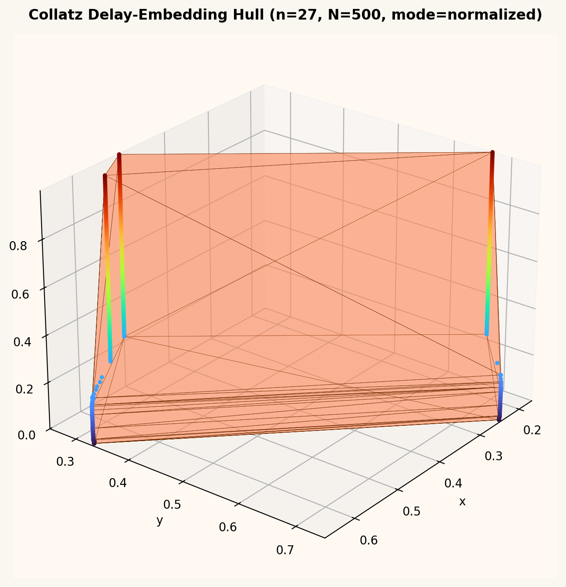

# Collatz ↔ Rupert (Delay-Embedding) — Experimental Repo

This repo is an **experimental testbed** for encoding Collatz-orbit structure into
3D convex polytopes via **rational delay embeddings**, then probing **projection containment**
(Rupert-like “shadow fits into shadow”) with lightweight computational heuristics.

## What this repo is (and is not)

✅ **Is**
- A forward-computable mapping `n ↦ P(n, N)` with **rational/algebraic coordinates**.
- Tools to compute convex hulls, export meshes, and measure geometry statistics.
- A **Rupert-style proxy search** (randomized) for 2D projection containment between projected hulls.

❌ **Is NOT**
- A proof of any equivalence between Collatz convergence and Rupert’s property.
- A complete Rupert decision procedure.

### Interactive Graphs

GitHub does not render `<iframe>` embeds inside `README.md`.
Open the live interactive page here:

[https://kugguk2022.github.io/collatz_rupert_delay_embedding/](https://kugguk2022.github.io/collatz_rupert_delay_embedding/)
        
## Install
Plain Python:

```bash
pip install -r requirements.txt
```

## Quickstart

Generate a polytope and export OBJ:

```bash
python scripts/generate_polytope.py --n 27 --N 500 --mode normalized --out examples/n27.obj
```

Render a PNG preview (tracked in-repo):

```bash
python scripts/render_polytope_png.py --n 27 --N 500 --mode normalized --out docs/assets/n27_polytope.png
```

### n=27 Polytope Preview



Run a simple projection-containment proxy:

```bash
python scripts/rupert_proxy.py --n 27 --N 400 --trials 200
```

Scan a range and write a CSV:

```bash
python scripts/scan_batch.py --nmin 2 --nmax 200 --N 200 --out examples/scan.csv
```

## Directory
- `src/` core library
- `scripts/` runnable CLI utilities
- `docs/` notes + claims/non-claims
- `examples/` generated assets (gitignored)
